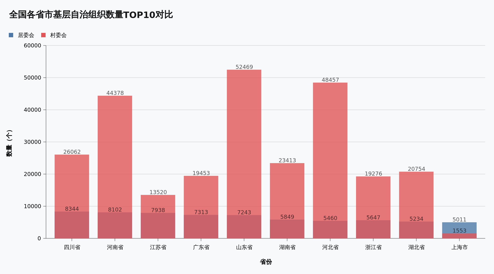
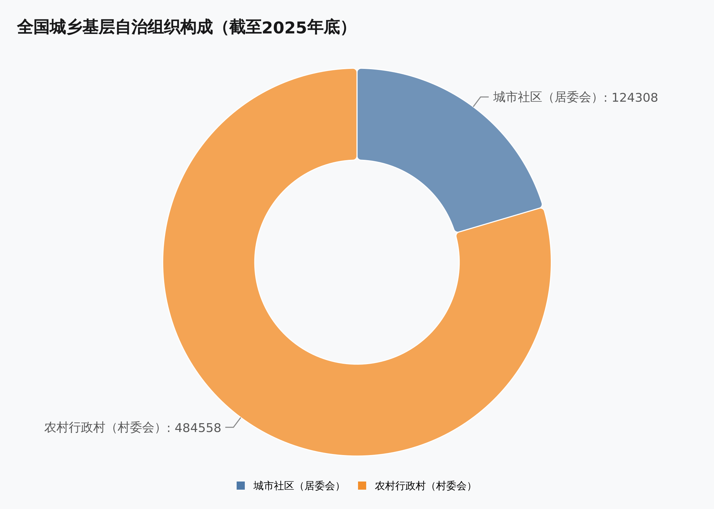
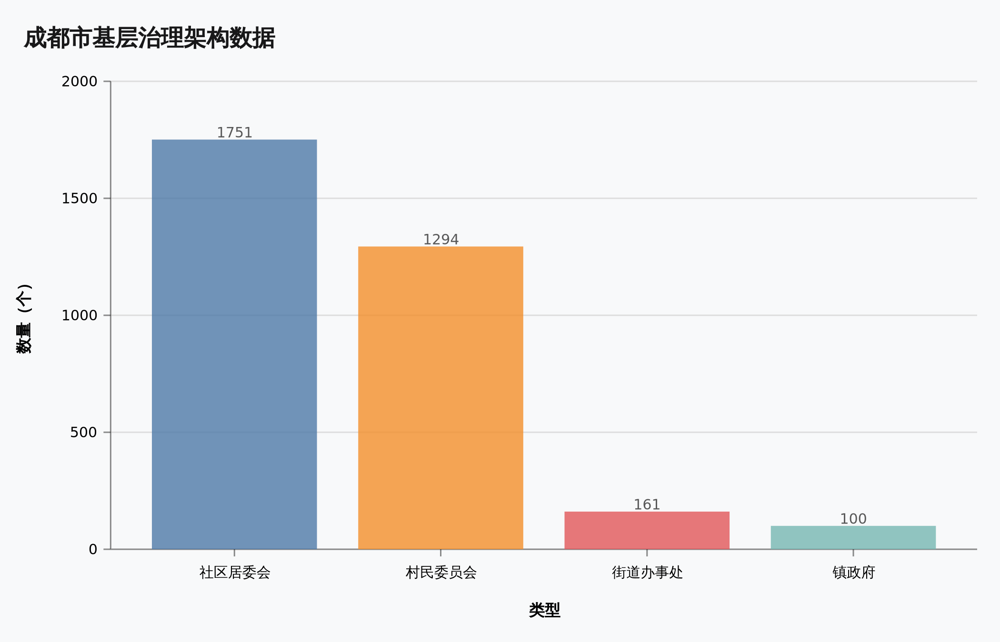
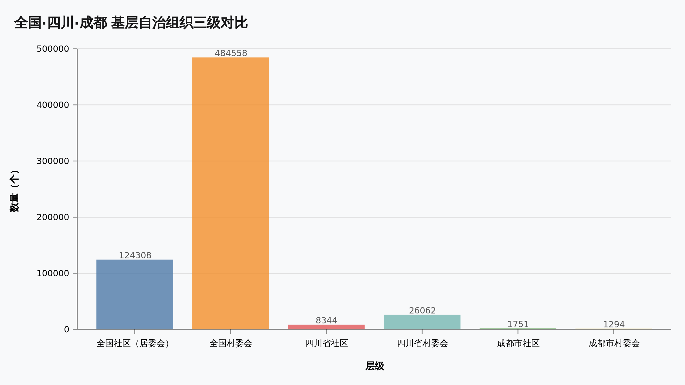
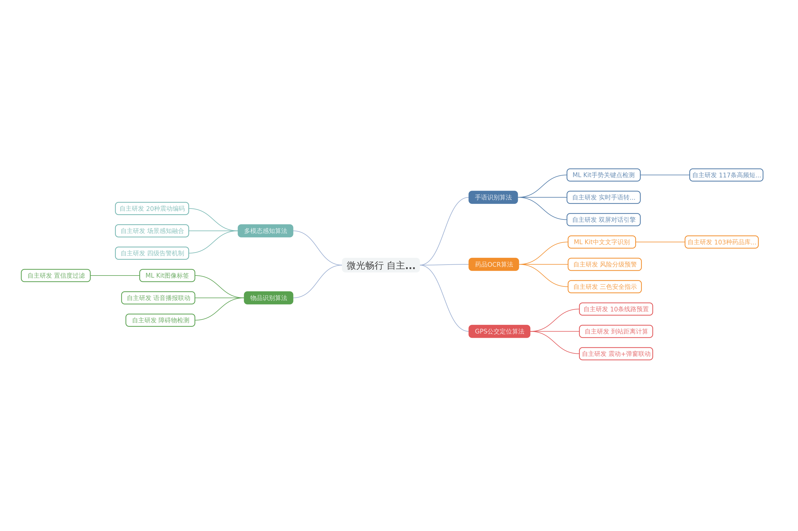
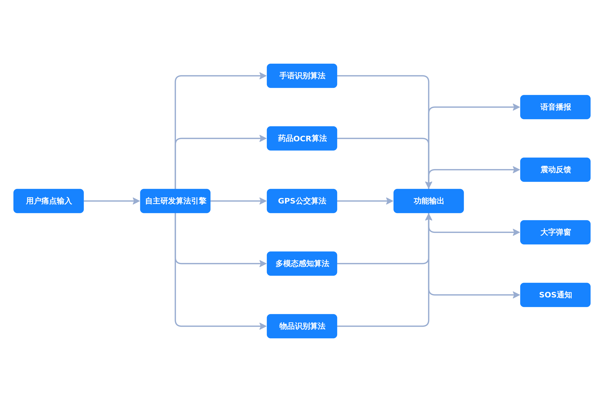

# 全国及成都市社区（居委会）数据调研报告

> 调研日期：2026-05-20
> 数据来源：民政部官方统计数据、《成都年鉴2024》
> 用途：为微光畅行无障碍助残APP山区适配方案提供基层网格数据支撑

---

## 一、全国社区（居委会）数据总览

### 1.1 核心数据（截至2025年12月31日）

| 指标 | 数量 | 数据来源 |
|------|------|----------|
| 全国居民委员会（社区）总数 | **124,308个** | 民政部《全国村（居）民委员会数据》 |
| 全国村民委员会总数 | **484,558个** | 民政部《全国村（居）民委员会数据》 |
| 全国居民委员会成员数 | **664,232人** | 民政部《全国村（居）民委员会数据》 |
| 全国村民委员会成员数 | **1,984,330人** | 民政部《全国村（居）民委员会数据》 |
| 城市街道 | 9,160个 | 2025年中国共产党党内统计公报 |
| 乡镇 | 29,607个 | 2025年中国共产党党内统计公报 |
| 行政村 | 486,326个 | 2025年中国共产党党内统计公报 |
| 社区（已建立党组织） | 121,270个 | 2025年中国共产党党内统计公报 |
| 全国社区社会组织 | 约270万家 | 民政部统计数据 |

### 1.2 关键解读

- **全国城乡基层自治组织总计约60.9万个**（居委会12.43万 + 村委会48.46万），这是国家基层治理的最小单元，也是助残服务落地的「最后一公里」触点。
- **每个居委会平均服务约1,000-3,000户居民**（依据《城市居民委员会组织法》），按此推算全国社区覆盖约1.2亿-3.7亿城镇人口。
- **社区社会组织约270万家**，其中约10%在县级民政部门登记，90%由街道/乡镇管理——这意味着助残公益组织可通过社区渠道实现规模化触达。

### 1.3 各省市社区（居委会）数量TOP10

| 排名 | 省份 | 居委会数量 | 村委会数量 | 基层自治组织合计 |
|------|------|-----------|-----------|-----------------|
| 1 | 山东省 | 7,243 | 52,469 | 59,712 |
| 2 | 河南省 | 8,102 | 44,378 | 52,480 |
| 3 | 河北省 | 5,460 | 48,457 | 53,917 |
| 4 | 四川省 | 8,344 | 26,062 | 34,406 |
| 5 | 广东省 | 7,313 | 19,453 | 26,766 |
| 6 | 湖南省 | 5,849 | 23,413 | 29,262 |
| 7 | 湖北省 | 5,234 | 20,754 | 25,988 |
| 8 | 江苏省 | 7,938 | 13,520 | 21,458 |
| 9 | 浙江省 | 5,647 | 19,276 | 24,923 |
| 10 | 安徽省 | 3,842 | 14,202 | 18,044 |

> 四川省居委会数量（8,344个）排名全国前列，村委会数量（26,062个）同样位居全国前列，说明四川省城乡基层治理体系完善，为助残服务下沉提供了良好的网格基础。

---

## 二、成都市社区数据

### 2.1 核心数据（来源：《成都年鉴2024》）

| 指标 | 数量 |
|------|------|
| 社区居委会 | **1,751个** |
| 村民委员会 | **1,294个** |
| 街道办事处 | 161个 |
| 镇政府 | 100个 |
| **城乡社区（村）合计** | **3,045个** |

### 2.2 补充数据交叉验证

| 数据来源 | 数据项 | 数值 | 验证结论 |
|----------|--------|------|----------|
| 儿童友好社区建设目标 | 儿童友好社区覆盖率50% | 社区总数约3,224个 | 与年鉴数据基本吻合 |
| 综合减灾标准化社区目标 | 2025年覆盖目标 | 3,000余个社区(村) | 与年鉴数据一致 |
| 涉农社区"川善治"平台 | 入驻平台 | 2,112个村（涉农社区） | 与村委会1,294+部分涉农社区吻合 |
| 成都市2025年城乡社区治理项目 | 参与社区(村) | 490个 | 为省级示范项目子集 |

### 2.3 成都社区分布特点分析

```
成都市基层治理架构：
├── 12个市辖区（锦江/青羊/金牛/武侯/成华/龙泉驿/青白江/
│              新都/温江/双流/郫都/新津）
├── 5个县级市（都江堰/彭州/邛崃/崇州/简阳）
├── 3个县（金堂/大邑/蒲江）
├── 161个街道办事处（管理城市社区）
├── 100个镇政府（管理农村地区）
├── 1,751个社区居委会（城市社区）
└── 1,294个村民委员会（农村行政村）
```

**关键特征：**
- 成都城市社区（1,751个）与农村行政村（1,294个）比例约为 **1.35:1**，说明成都既有发达的城市社区网络，也有广大的农村基层治理单元
- 涉农社区约2,112个（含部分已城市化但保留涉农属性的社区），占全市社区(村)总数约 **69%**——这与达州万源的山区现状形成鲜明对比
- 成都作为四川省会，其社区治理体系相对完善，但偏远山区（如达州万源）的社区基础条件差异显著

---

## 三、数据对微光畅行项目的战略意义

### 3.1 基层触达网格

全国 **12.43万个社区** 和 **48.46万个行政村**，构成了助残服务可依托的完整基层触达网络。对于微光畅行APP而言：

| 层级 | 数量 | 对接方式 | 助残服务价值 |
|------|------|----------|-------------|
| 全国社区居委会 | 12.43万 | APP内嵌社区服务入口 | 城市轻度残疾人服务落地 |
| 全国村委会 | 48.46万 | 村委会代办/村医联动 | 山区重度残疾人兜底帮扶 |
| 成都市社区 | 1,751个 | 本地化示范基地打造 | 成都试点→四川推广→全国复制 |
| 成都市行政村 | 1,294个 | 驻村帮扶干部对接 | 山区适配功能验证 |

### 3.2 成都作为试点城市的优势

1. **社区密度高**：1,751个社区 + 161个街道 = 丰富的城市试点场景
2. **农村基数大**：1,294个行政村 = 山区版功能可找到充足测试样本
3. **政策先行**：成都已建成1,612个儿童友好社区、100个嵌入式服务示范社区，基层治理能力强
4. **辐射效应**：成都作为四川省会，其成功经验可通过全省8,344个社区、26,062个行政村快速复制

### 3.3 达州万源战略定位

达州万源市（刚脱贫山区）虽不在本次统计的成都数据范围内，但可作为**四川省农村助残攻坚的典型样本**：

| 对比维度 | 成都（城市代表） | 达州万源（山区代表） |
|----------|-----------------|---------------------|
| 社区治理成熟度 | 高 | 低 |
| 基层数字化水平 | 较高 | 极低 |
| 重度残疾人密度 | 相对分散 | 高度集中 |
| 适配产品类型 | 现有APP功能 | 需全新山区版 |

---

## 四、数据来源说明

| 序号 | 数据项 | 来源 | 时间节点 |
|------|--------|------|----------|
| 1 | 全国居委会/村委会总数 | 民政部《全国村（居）民委员会数据》官方文件 | 截至2025年12月31日 |
| 2 | 全国街道/乡镇/社区党组织覆盖 | 2025年中国共产党党内统计公报 | 2025年7月发布 |
| 3 | 成都社区/村委会/街道/镇数据 | 《成都年鉴2024》- 成都市地方志办公室 | 2024年版 |
| 4 | 儿童友好社区覆盖率 | 成都市儿童友好社区建设报道 | 2024年 |
| 5 | 综合减灾标准化社区目标 | 成都市应急管理报道 | 2025年目标 |
| 6 | 全国社区社会组织 | 民政部数据 | 近年统计 |

---

## 五、附录：各省市居委会/村委会完整数据

| 省份 | 村委会总数 | 居委会总数 | 村民委员会成员数 | 居民委员会成员数 |
|------|-----------|-----------|-----------------|-----------------|
| 全国 | 484,558 | 124,308 | 1,984,330 | 664,232 |
| 北京市 | 3,643 | 3,760 | 13,246 | 22,963 |
| 天津市 | 3,514 | 1,963 | 12,526 | 7,409 |
| 河北省 | 48,457 | 5,460 | 163,882 | 25,266 |
| 山西省 | 18,722 | 2,966 | 71,531 | 15,372 |
| 内蒙古 | 11,029 | 2,894 | 44,943 | 14,738 |
| 辽宁省 | 11,550 | 4,966 | 44,065 | 26,206 |
| 吉林省 | 9,341 | 2,115 | 35,801 | 14,184 |
| 黑龙江 | 9,028 | 3,167 | 41,281 | 17,375 |
| 上海市 | 1,553 | 5,011 | 5,756 | 24,967 |
| 江苏省 | 13,520 | 7,938 | 63,733 | 40,395 |
| 浙江省 | 19,276 | 5,647 | 74,075 | 28,581 |
| 安徽省 | 14,202 | 3,842 | 62,183 | 21,441 |
| 福建省 | 14,235 | 3,150 | 55,664 | 17,493 |
| 江西省 | 16,995 | 4,628 | 70,881 | 22,113 |
| 山东省 | 52,469 | 7,243 | 201,876 | 39,163 |
| 河南省 | 44,378 | 8,102 | 186,214 | 44,541 |
| 湖北省 | 20,754 | 5,234 | 78,505 | 28,325 |
| 湖南省 | 23,413 | 5,849 | 84,044 | 27,384 |
| 广东省 | 19,453 | 7,313 | 86,378 | 43,331 |
| 广西 | 14,162 | 2,376 | 72,317 | 15,332 |
| 海南省 | 2,502 | 750 | 12,969 | 4,515 |
| 重庆市 | 7,917 | 3,335 | 38,575 | 20,233 |
| **四川省** | **26,062** | **8,344** | **110,819** | **41,287** |
| 贵州省 | 13,696 | 4,354 | 64,907 | 25,235 |
| 云南省 | 11,572 | 3,461 | 52,787 | 17,871 |
| 西藏 | 5,281 | 335 | 23,452 | 2,098 |
| 陕西省 | 16,769 | 3,656 | 67,843 | 21,936 |
| 甘肃省 | 15,894 | 1,685 | 71,090 | 7,044 |
| 青海省 | 4,149 | 529 | 16,415 | 3,399 |
| 宁夏 | 2,209 | 664 | 9,776 | 4,163 |
| 新疆 | 8,740 | 3,017 | 46,426 | 16,431 |
| 新疆兵团 | 73 | 554 | 370 | 3,441 |

> 数据来源：民政部《全国村（居）民委员会数据（截至2025年12月31日）》
> 注：居委会即社区居民委员会，对应日常所称的"社区"

---

## 六、数据可视化图表

以下图表已保存至项目目录 [docs/assets/charts/](file:///f:/java/weiguangplus/docs/assets/charts/)：

### 6.1 全国各省市基层自治组织数量TOP10对比（分组柱状图）



> 各省市居委会与村委会数量对比，蓝色=居委会，红色=村委会

### 6.2 全国城乡基层自治组织构成（环形图）



> 全国12.43万个城市社区 vs 48.46万个农村行政村，农村行政村占比79.6%

### 6.3 成都市基层治理架构数据（柱状图）



> 1,751个社区居委会 · 1,294个村委会 · 161个街道 · 100个镇

### 6.4 全国·四川·成都 三级对比（柱状图）



> 从全国→四川省→成都市，清晰地展示基层自治组织的金字塔结构

### 6.5 自主研发算法架构思维导图



> 五大核心自主研发算法体系：手语识别、药品OCR、GPS公交定位、多模态感知、物品识别

### 6.6 自主研发算法流程图



> 用户痛点→自主研发算法引擎→五大算法→功能输出→四种交互反馈 完整链路

---

*本报告由微光畅行战略参谋团队编制，数据均来源于官方公开渠道*