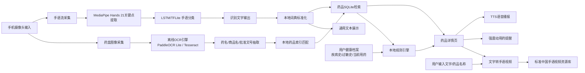

# 无障碍APP：手语识别+药品OCR开发对接流程图 v1.0

## 1. 文档定位

本文档用于把“手语识别 + 药品 OCR + 本地药品检索 + 手语视频回放 + TTS + 强震动提醒”整理成一页式开发对接说明，供安卓端、算法端、数据处理端统一对齐开发边界、依赖关系、数据流转和接口定义。

## 2. 对接结论先行

- 本文档描述的是`目标版全链路离线架构`，不是 4 天内一次性全部完成的现实交付范围。
- 若严格执行“4 天首版交付”，建议拆成两层：
  - `比赛可交付版`：药品 OCR 闭环 + 手语视频回放 + 高频词手语识别 Demo + TTS + 强震动提醒。
  - `工程目标版`：500 词中国手语离线识别 + 3 万条药品 SQLite 离线库 + 全链路双向联动。
- 所有医学输出统一定位为`辅助查询与风险提醒`，不能表述为诊断或处方建议。

## 3. 一页式开发对接流程图



## 4. 模块依赖关系

| 模块 | 上游依赖 | 下游输出 | 是否首版必须 |
|---|---|---|---|
| 摄像头采集层 | CameraX/系统权限 | 手语视频流、药盒图像流 | 是 |
| 手语关键点提取 | MediaPipe Hands | 21 关键点时序数据 | 是 |
| 手语识别模型 | LSTM + TFLite | 中文词汇、字母、数字识别结果 | 是 |
| 文字转手语播放 | 本地手语词典、视频资源索引 | 标准手语演示视频 | 是 |
| OCR 识别模块 | PaddleOCR Lite 或 Tesseract | 药盒文字块、候选药名 | 是 |
| 药品标准化匹配 | 药品别名表、批准文号规则 | 标准药品主键 drug_id | 是 |
| SQLite 药品库 | 清洗后的药品数据表 | 说明书、禁忌、剂量等字段 | 是 |
| 健康档案模块 | 本地表单、用户录入 | 疾病史、过敏史、当前用药 | 是 |
| 本地规则引擎 | 药品库 + 健康档案 | 用药风险提示 | 是 |
| TTS 模块 | Android TTS | 语音播报 | 是 |
| 强震动提醒 | Vibrator/VibratorManager | 震动提醒 | 是 |
| 日程提醒模块 | AlarmManager/WorkManager | 用药日程触发 | 次阶段 |

## 5. 标准数据流转

### 5.1 药盒拍摄到药品详情

1. 用户打开药品识别页并拍摄药盒。
2. App 调用本地 OCR 引擎提取文字块。
3. 本地解析器抽取通用名、商品名、批准文号。
4. 查询本地 `drug_alias` 与 `drug_master`。
5. 定位标准药品主键后查询 `drug_detail`。
6. 联合 `user_profile` 和 `drug_rule` 输出风险提示。
7. 将结果展示为文字、大字模式、TTS 播报和手语视频入口。

### 5.2 手语输入到药品检索

1. 用户打开小玉模块并做出手语动作。
2. CameraX 连续采样视频帧。
3. MediaPipe 提取 21 个手部关键点。
4. 关键点序列输入 LSTM/TFLite 模型。
5. 输出识别结果文本。
6. 若文本命中药品词典或药品别名字典，直接发起本地药品检索。
7. 返回药品详情、注意事项和播报按钮。

### 5.3 文字到手语视频

1. 用户输入药品名称或系统检索到标准药名。
2. 文本标准化模块切分为词级 token。
3. 优先查找完整药名手语视频。
4. 若无完整词视频，则回退到词组拆分或字母数字拼写视频。
5. 本地播放器顺序播放标准手语演示资源。

## 6. 核心接口定义

### 6.1 摄像头输入接口

```kotlin
interface CameraFrameProvider {
    fun startSignStream()
    fun captureMedicineImage(): ByteArray
    fun stop()
}
```

### 6.2 手语识别接口

```kotlin
data class SignInferenceResult(
    val text: String,
    val confidence: Float,
    val latencyMs: Long
)

interface SignRecognizer {
    fun inferFromKeypoints(sequence: FloatArray): SignInferenceResult
}
```

### 6.3 OCR 识别接口

```kotlin
data class OcrToken(
    val text: String,
    val score: Float
)

interface OcrEngine {
    fun recognize(imageBytes: ByteArray): List<OcrToken>
}
```

### 6.4 药品检索接口

```kotlin
data class DrugQuery(
    val genericName: String? = null,
    val tradeName: String? = null,
    val approvalNo: String? = null
)

interface DrugRepository {
    fun search(query: DrugQuery): DrugDetail?
    fun searchByRecognizedText(text: String): List<DrugDetail>
}
```

### 6.5 文字转手语接口

```kotlin
data class SignVideoClip(
    val token: String,
    val localPath: String,
    val durationMs: Long
)

interface TextToSignService {
    fun resolveVideoSequence(text: String): List<SignVideoClip>
}
```

### 6.6 无障碍输出接口

```kotlin
interface AccessibilityOutputService {
    fun speak(text: String)
    fun vibratePreset(presetId: String)
}
```

## 7. 本地数据表设计

### 7.1 药品库建议表结构

| 表名 | 关键字段 | 用途 |
|---|---|---|
| `drug_master` | `drug_id`, `generic_name`, `trade_name`, `approval_no` | 药品主表 |
| `drug_alias` | `alias_id`, `drug_id`, `alias_name` | 别名和 OCR 模糊命中 |
| `drug_detail` | `drug_id`, `indication`, `dosage`, `taboo`, `attention`, `adverse_reaction` | 说明书详情 |
| `drug_category` | `category_id`, `category_name` | 药理分类 |
| `drug_interaction` | `drug_id`, `risk_text` | 药物相互作用扩展 |
| `user_profile` | `user_id`, `age_group`, `disease_tags`, `allergy_tags`, `current_drugs` | 用户健康档案 |
| `drug_rule` | `rule_id`, `match_field`, `rule_type`, `risk_level`, `message` | 风险规则 |
| `sign_dictionary` | `token`, `gloss`, `video_path` | 文字到手语资源映射 |

### 7.2 手语资源建议结构

| 资源 | 内容 |
|---|---|
| `sign_label_map.json` | 手语分类标签到中文词汇映射 |
| `sign_token_meta.json` | 词汇、字母、数字资源索引 |
| `videos/sign/` | 标准手语视频资源 |
| `models/sign_lstm_int8.tflite` | 量化后的离线识别模型 |
| `models/ocr/` | OCR 轻量模型文件 |

## 8. 模型与性能约束

### 8.1 手语识别侧

- 数据集目标：`CSL 常用词` + `DEVISIGN 字母数字手语`。
- 首轮训练目标：500 个常用手语词 + 10 个阿拉伯数字 + 26 个英文字母。
- 特征形式：每帧 21 个关键点，建议保留 `x/y/z + visibility` 扩展位。
- 模型建议：`2层 LSTM + Dropout + 全连接分类头`。
- 导出要求：转为 `TFLite int8` 或 `float16` 量化模型。
- 端侧目标：延迟小于 200ms，帧率 30FPS，模型体积小于 5MB。

### 8.2 OCR 侧

- 首选方案：PaddleOCR 移动端轻量化模型。
- 备选方案：Tesseract 离线 OCR。
- 识别目标：通用名、商品名、批准文号。
- 评估指标：药盒印刷体识别准确率目标 95%，但需要在真实药盒数据集上单独复核。

## 9. 无障碍适配要求

- 默认提供大字模式、高对比度卡片和关键信息聚焦展示。
- 所有药品详情支持一键 TTS 播报。
- 强提醒支持多段震动模板，兼容听障用户使用。
- 关键操作必须支持单手、低误触、低认知负担。
- WCAG 2.1 AA 作为设计目标，但 Android 原生落地需结合 TalkBack、字体缩放和颜色对比度逐项验收。

## 10. 外部数据源接入说明

### 10.1 NMPA 官方药品数据查询平台

- 地址：`https://www.nmpa.gov.cn/datasearch`
- 定位：权威官方来源，适合作为药品标准名、批准文号和监管信息的校验来源。
- 接入建议：
  - 不直接依赖在线实时接口作为离线主库。
  - 采用脚本定期抓取可公开查询字段后，本地标准化入库。
  - 首版只保留字段：`generic_name`、`trade_name`、`approval_no`、`manufacturer`。
- 风险提示：网页自动化抓取稳定性和反爬策略需要额外评估。

### 10.2 tngou 免费药品 API

- 地址：`https://www.tngou.net/api/drug`
- 定位：可作为历史公开 API 线索。
- 接入建议：
  - 不作为正式生产主数据源。
  - 先人工核验接口可用性、字段一致性和许可证。
  - 仅在调试期用于补样本，不进入正式离线底库。
- 风险提示：当前自动化访问结果异常，稳定性和可信度不足。

### 10.3 DataSN 3 万条标准药品库

- 地址：`https://network.datasn.io/p/999`
- 定位：规模较大的药品标准化数据资源，可作为离线 SQLite 基础库候选。
- 接入建议：
  - 先明确授权方式、会员方案和可商用范围。
  - 取其 `drug`, `category`, `category_x_drug` 主表做清洗。
  - 离线包中优先保留高频药和核心说明字段，控制安装包体积。
- 风险提示：该资源需要登录和会员方案，不应被表述为零成本可直接落地。

### 10.4 丁香园安卓端药品离线包

- 地址：`https://drugs.dxy.cn/android/download.htm`
- 定位：已存在离线包下载和安装说明，可作为数据组织方式参考。
- 接入建议：
  - 优先用于研究离线药品包的组织形式，不直接默认可合法二次分发。
  - 若要用于正式产品，必须先确认版权授权与再分发边界。
- 风险提示：第三方离线包通常涉及版权和分发限制，不能直接打包进参赛作品后再公开发布。

## 11. 4 天交付下的最简落地切法

| 天数 | 安卓端 | 算法端 | 数据端 |
|---|---|---|---|
| Day 1 | CameraX 页面、药品识别页、小玉页 | 跑通 MediaPipe Hands Demo | 清洗 200-500 条高频药品数据 |
| Day 2 | 接入 OCR 本地调用、SQLite 查询页 | 输出字母数字 + 20-50 词手语分类 Demo | 建立 `drug_master` + `drug_detail` |
| Day 3 | 接 TTS、强震动、手语视频播放 | 导出 TFLite Demo 模型 | 建立别名表、批准文号规则 |
| Day 4 | 联调展示流程、修复 UI 与无障碍问题 | 调优延迟和置信度展示 | 生成离线数据库和测试样本 |

## 12. 开发对接建议

- 安卓端先定 `接口壳子 + 页面流转 + 本地数据库读写`。
- 算法端先交付 `MediaPipe 关键点输出` 和 `TFLite 推理 Demo`。
- 数据端先交付 `高频药小库`，不要第一天就冲 3 万条全量库。
- 产品侧先定义 `500 词目标词表` 和 `药品高频场景优先级`，否则训练和视频资源都无法收敛。
- 合规侧先确认第三方数据源是否允许离线打包与比赛展示。
